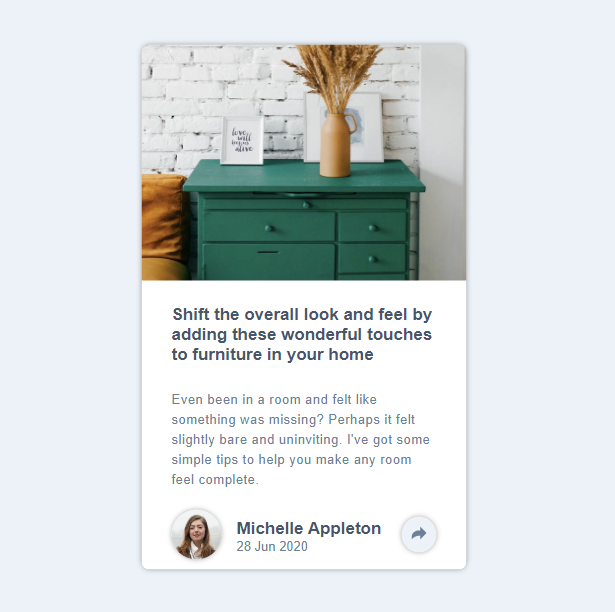

# $\color[RGB]{54,148,77}Article-preview-component-FM$
Frontend mentor challenge, Article preview component

<kbd>
  
</kbd>

$\color[RGB]{54,148,77} $

### $\color[RGB]{54,148,77}Built$ $\color[RGB]{54,148,77}with$
- Semantic HTML5 markup
- CSS custom properties
- Flexbox

### $\color[RGB]{54,148,77} What I learned $

- Basic positioning in html
- How to make a "bubble text dialog" with css
- Some practice with js.

## $\color[RGB]{54,148,77} Author $

- Website - [Live website](https://article-preview-component-theta-eight.vercel.app)
- Frontend Mentor - [@Jocad7](https://www.frontendmentor.io/profile/Jocad7)
